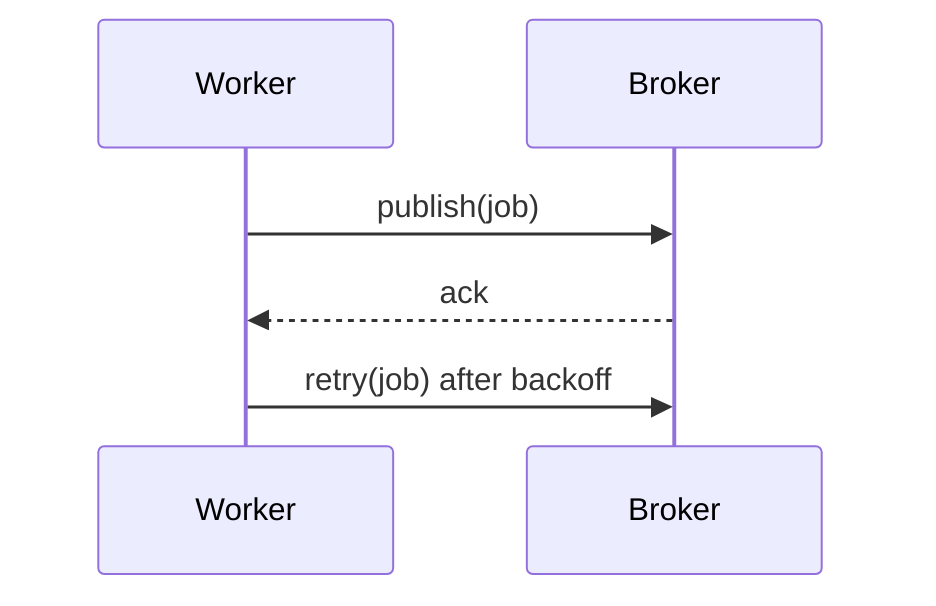

# PR Summary: [release → staging] Retry policy

## Overview

Introduces a retry policy with exponential backoff for outbound calls.

```mermaid
sequenceDiagram
    participant Worker
    participant Broker
    Worker->>Broker: publish(job)
    Broker-->>Worker: ack
    Worker->>Broker: retry(job) after backoff
```

**[TRIAGE]:** NEEDS_REVIEW
