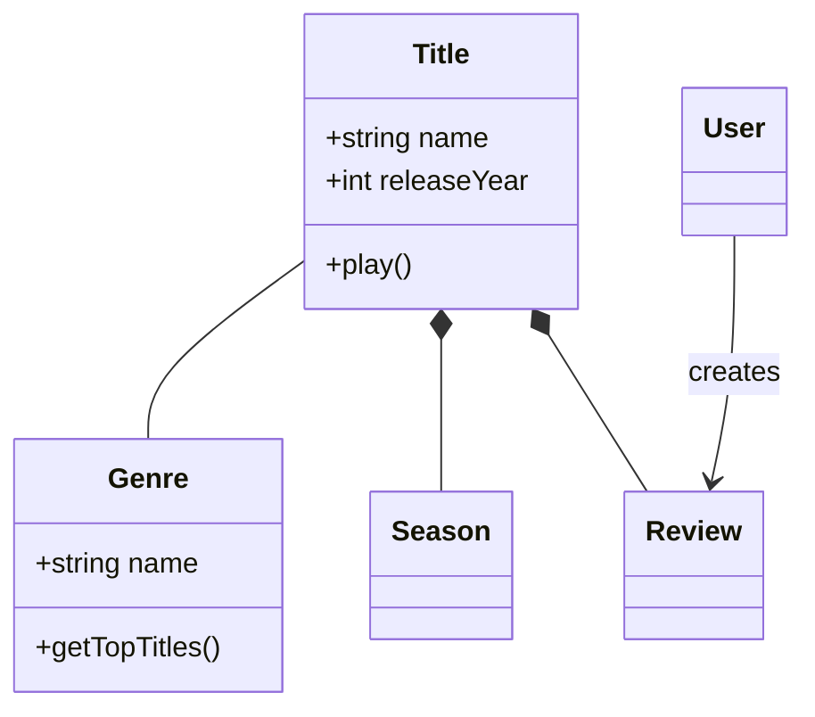
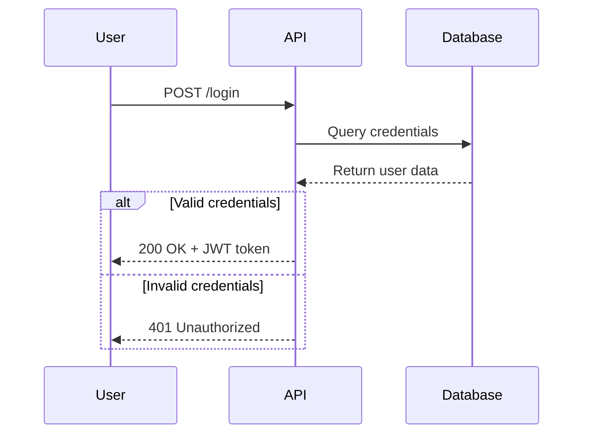
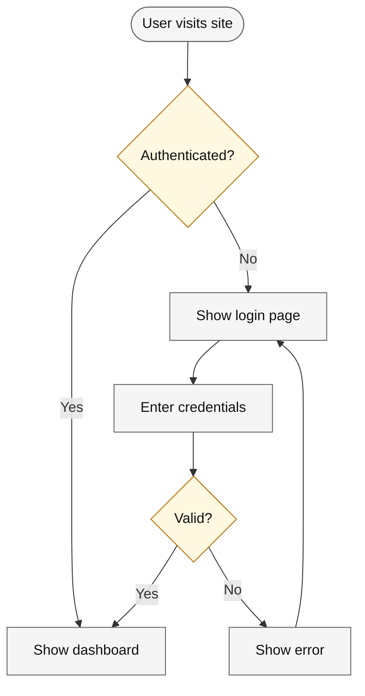
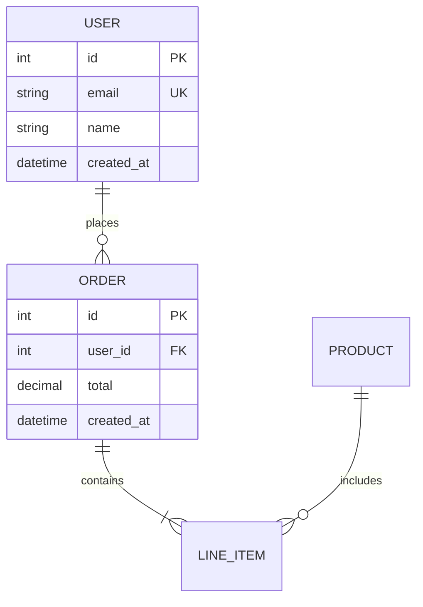
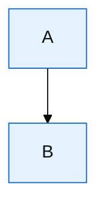

# Mermaid Diagramming

Create professional software diagrams using Mermaid's text-based syntax. Mermaid renders diagrams from simple text definitions, making diagrams version-controllable, easy to update, and maintainable alongside code.

## Core Syntax Structure

All Mermaid diagrams follow this pattern:

```mermaid
diagramType
  definition content
```

**Key principles:**
- First line declares diagram type (e.g., `classDiagram`, `sequenceDiagram`, `flowchart`)
- Use `%%` for comments
- Line breaks and indentation improve readability but aren't required
- Unknown words break diagrams; parameters fail silently

## Classify before you draw

Read **[references/authoring-rules.md](references/authoring-rules.md)** and apply section 1 before any node. A flowchart is not the default.

Write one sentence: what question does this diagram answer? Then pick the type that owns that question. Two questions means two diagrams.

| If the question is… | Draw | Not a flowchart |
|---|---|---|
| Who calls whom, in order? | Sequence | API, login, call chain |
| What types exist and how do they relate? | Class | Domain model, OOP |
| What tables and cardinality? | ERD | Schema |
| What systems, containers, or components exist? | C4 | "The architecture" with no walked procedure |
| What states and legal transitions? | State | Lifecycle |
| A process someone walks, with yes/no branches? | Flowchart | Only after the rows above lose |

"Show the flow" and "how does X work" are not evidence for a flowchart. Reject it when a sequence, C4, class, or ERD answers the question more honestly.

After the type is chosen, apply the rest of `authoring-rules.md`: reading-column proportions, subgraph boundary connections, role shapes, and a palette from that file. Do not invent hex colors.

## Quick Start Examples

### Class Diagram (Domain Model)


### Sequence Diagram (API Flow)


### Flowchart (User Journey)


### ERD (Database Schema)


## Detailed References

**MANDATORY** before the first node: read [references/authoring-rules.md](references/authoring-rules.md).

Then load only the file for the type you chose. **Do NOT load** the others.

| Type chosen | Read | Do NOT load |
|---|---|---|
| Class | [references/class-diagrams.md](references/class-diagrams.md) | sequence, flowchart, erd, c4, architecture, advanced-features |
| Sequence | [references/sequence-diagrams.md](references/sequence-diagrams.md) | class, flowchart, erd, c4, architecture, advanced-features |
| Flowchart | [references/flowcharts.md](references/flowcharts.md) | class, sequence, erd, c4, architecture, advanced-features |
| ERD | [references/erd-diagrams.md](references/erd-diagrams.md) | class, sequence, flowchart, c4, architecture, advanced-features |
| C4 | [references/c4-diagrams.md](references/c4-diagrams.md) | class, sequence, flowchart, erd, architecture, advanced-features |
| Cloud services or CI/CD boxes, and the user did not ask for C4 | [references/architecture-diagrams.md](references/architecture-diagrams.md) | the other type files. Warn that `aws:` and `logos:` icons render as `?` on GitHub and in the VS Code preview. Built-in icons are `cloud`, `database`, `disk`, `internet`, `server`. |
| Theming or export failed | [references/advanced-features.md](references/advanced-features.md) | the type files you already used |

Do not use architecture-diagrams as the default for "the architecture". That question is C4. Use the architecture file only for cloud or CI/CD boxes.

## Best Practices

1. **Classify first** - Name the question, then the type. Do not open with `flowchart`.
2. **Fit the column** - Docs render in ~900px and scale to fit. Prefer top-down. Do not widen a diagram or switch to `LR` to "fix" crowding.
3. **Connect groups at the boundary** - Subgraph to subgraph. An inner-to-inner edge silently drops that subgraph's `direction`.
4. **Shapes are roles** - Diamond for a branch, cylinder for a store, stadium for start/end, rectangle for a step.
5. **Color by role** - Copy a palette from `authoring-rules.md`. Same role, same `classDef`. No more than six fills.
6. **One idea** - Split architecture, sequence, and schema into separate diagrams.
7. **Use Meaningful Names** - Clear labels make diagrams self-documenting
8. **Comment with `%%`** - Explain a non-obvious relationship in the diagram, not in a separate note the renderer drops
9. **Add context** - A title or a note states what question this diagram answers
10. **Keep the source** - Store the `.mmd` next to the code when the diagram is maintained with it
11. **Validate before you ship** - Render in [Mermaid Live](https://mermaid.live) or `mmdc`. A clean-looking fence can still be a syntax bomb on GitHub

## Configuration and Theming

Configure diagrams using frontmatter:



**Available themes:** default, forest, dark, neutral, base

**Layout options:**
- `layout: dagre` (default) - Classic balanced layout
- `layout: elk` - Advanced layout for complex diagrams (requires integration)

**Look options:**
- `look: classic` - Traditional Mermaid style
- `look: handDrawn` - Sketch-like appearance

## Exporting and Rendering

**Native support in:**
- GitHub/GitLab - Automatically renders in Markdown
- VS Code - With Markdown Mermaid extension
- Notion, Obsidian, Confluence - Built-in support

**Export options:**
- [Mermaid Live Editor](https://mermaid.live) - Online editor with PNG/SVG export
- Mermaid CLI - `npm install -g @mermaid-js/mermaid-cli` then `mmdc -i input.mmd -o output.png`
- Docker - `docker run --rm -v $(pwd):/data minlag/mermaid-cli -i /data/input.mmd -o /data/output.png`

## Common Pitfalls

- **Defaulting to a flowchart** - Classify first. Sequence, C4, class, and ERD are the usual correct types.
- **Unquoted special characters** - `( ) [ ] { } < > " | ; #` in a label must be inside quotes: `A["Deploy (prod)"]`
- **Reserved `end`** - Lowercase `end` is reserved. Write `End` or quote it.
- **Inner-to-inner subgraph edges** - They drop `direction` with no error. Connect subgraph to subgraph.
- **Wide `LR` in docs** - The column scales the SVG down and the text becomes illegible. Prefer `TD`.
- **Garish or per-node color** - Copy a palette. Color by role. Red and green are not enough on their own.

## When to Create Diagrams

**Always diagram when:**
- Starting new projects or features
- Documenting complex systems
- Explaining architecture decisions
- Designing database schemas
- Planning refactoring efforts
- Onboarding new team members

**Use diagrams to:**
- Align stakeholders on technical decisions
- Document domain models collaboratively
- Visualize data flows and system interactions
- Plan before coding
- Create living documentation that evolves with code
