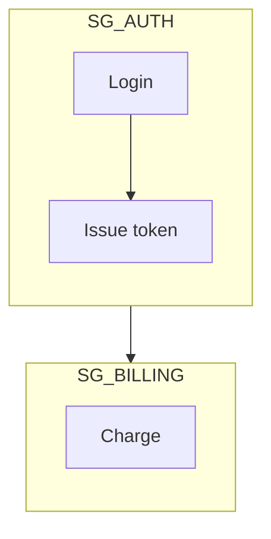

# Authoring rules

Apply these before writing nodes. Syntax catalogs live in the type references. This file is the gate: diagram type, screen shape, connections, shapes, and color.

## 1. Classify the type first

Do not start a `flowchart` because it is the familiar default. A flowchart is for a process a person or algorithm walks, with decisions. Most "how does this work" and "show the architecture" requests are a different type.

Before the first node, write one sentence: what question does this diagram answer? Pick the type that owns that question. If the sentence has two questions, draw two diagrams.

| Question | Type | Keyword |
|---|---|---|
| Who calls whom, in what order? | Sequence | `sequenceDiagram` |
| What types exist and how do they relate? | Class | `classDiagram` |
| What tables, keys, and cardinality? | ERD | `erDiagram` |
| What systems, containers, or components exist, and who uses them? | C4 | `C4Context` / `C4Container` / `C4Component` |
| What states and legal transitions? | State | `stateDiagram-v2` |
| How do branches diverge and merge? | Git | `gitGraph` |
| When do tasks start and end? | Gantt | `gantt` |
| What share of a whole? | Pie | `pie` |
| What process does someone walk, with yes/no branches? | Flowchart | `flowchart` |

Reject the flowchart when any of these is true:

- The subject is an API, login, or call chain. That is a sequence.
- The subject is a domain model or OOP structure. That is a class diagram.
- The subject is a schema. That is an ERD.
- The subject is "the system", "the architecture", or "what talks to what" without a walked procedure. That is C4.
- The subject is a lifecycle. That is a state diagram.

Flowchart only after the other types lose. "Show the flow" is not evidence for a flowchart.

## 2. Screen and proportion

The reader is a Markdown column (GitHub, GitLab, docs): about 900px, centered, scaled to fit. Extra width is shrunk, and the text drops below reading size. Do not fix a cramped diagram by making it wider or switching to `LR`.

- Prefer `flowchart TD` (and top-down structure in other types). Use `LR` only for a short row of three or four nodes.
- Rendered height/width must stay at or above 0.4. Flatter than that is too horizontal.
- Rendered height must stay under about three viewport pages. Taller than that is a scroll, not a diagram. Split it.
- One idea per diagram. Architecture plus sequence plus schema in one picture is the defect. Split.

You cannot place nodes. The only levers are subgraphs, per-subgraph `direction`, and declaration order. Declare nodes in reading order. Keep the primary path monotonic.

## 3. Connections

- Group related nodes into a `subgraph` once a flowchart has about ten or more nodes.
- Connect groups at the boundary: subgraph to subgraph, or subgraph to an outside node. Do not draw an edge from a node buried in one subgraph to a node buried in another.
- Reason: if any node inside a subgraph links outside, Mermaid ignores that subgraph's `direction` and inherits the parent's. No error is raised. You lose the layout you set.
- Keep internal nodes internal. Wire the groups together.
- A subgraph `direction` is valid only while none of its nodes link outside.
- Name groups and nodes so membership is obvious: `SG_AUTH` / `NODE_AUTH_login`.



## 4. Shapes mean roles

Reserve a shape for a role. Do not mix shapes for the same role, and do not invent a new shape per node.

| Role | Shape | Syntax |
|---|---|---|
| Step | Rectangle | `A[Step]` |
| Decision (two or more outgoing branches) | Diamond | `A{Valid?}` |
| Store / database / cache | Cylinder | `A[(Orders DB)]` |
| Start or end | Stadium | `A([Start])` |

A labeled branch drawn as a rectangle is wrong. A node whose name is a database, cache, queue, or store and is not a cylinder is wrong. More than four shapes with no role system is noise.

## 5. Palette

Six or more nodes with no `classDef` read as flat default gray. Give them a palette. More than six distinct fills is garish. Collapse to semantic classes.

Color is by role, not by node. Same role, same class: `class NODE_AUTH_login,NODE_AUTH_token svc`.

Red and green must not be the only channel. Pair color with shape or label so the diagram still reads in grayscale.

**Contrast is harmony of the whole diagram, not a fixed ink color.** Black, gray, or white can all be correct. What fails is a part that does not separate from what it sits on: text from its node fill, the node from its container, the container and the edges from the page.

The page background is the user's choice: transparent, light, dark, or another color. `#ffffff` and a dark plate are suggestions, not a closed default. If the background is transparent, the diagram must still read on both a light host and a dark host, or ask which theme it will sit on.

Set `color` on every `classDef` so the host theme cannot leave a label in a low-contrast default. On a light fill use a dark ink. On a dark fill use a light ink. The `#111111` values in the palettes below are dark ink for those light fills, not the only legal text color.

For a diagram embedded in Markdown, also set the theme text colors so edge labels and unclassed nodes follow the same ink. `classDef` does not cover them. Match the ink to the page the user chose. This example is dark ink on a light page:

```mermaid
---
config:
  theme: base
  themeVariables:
    primaryTextColor: "#111111"
    secondaryTextColor: "#111111"
    tertiaryTextColor: "#111111"
    textColor: "#111111"
    lineColor: "#333333"
---
```

One accent family per diagram. Accent the 10–20% of nodes that matter. Leave the rest neutral.

Copy a block. Do not invent hex colors.

### A. Structural / layer

Architecture and service maps.

```
classDef edge   fill:#e3f2fd,stroke:#1565c0,color:#111111
classDef svc    fill:#ede7f6,stroke:#4527a0,color:#111111
classDef data   fill:#e8f5e9,stroke:#2e7d32,color:#111111
classDef extern fill:#eceff1,stroke:#455a64,color:#111111
```

### B. Status

Keep the names `success`, `warning`, and `error`. What changes is the fill: the old saturated hex (`#00b894`, `#fdcb6e`, `#ff6b6b`) fails contrast on a white canvas. Use these. Put the word in the label too, so red versus green is not the only signal.

```
classDef base    fill:#f5f5f5,stroke:#616161,color:#111111
classDef success fill:#e8f5e9,stroke:#2e7d32,color:#111111
classDef warning fill:#fff8e1,stroke:#b26a00,color:#111111
classDef error   fill:#fdecea,stroke:#c62828,color:#111111
```

### C. Old vs new

Migration or before/after.

```
classDef old fill:#eceff1,stroke:#607d8b,color:#111111
classDef new fill:#e8f5e9,stroke:#2e7d32,color:#111111
```

## 6. Labels that break the parser

- Quote labels that contain `( ) [ ] { } < > " | ; #`. `A[Deploy (prod)]` breaks. `A["Deploy (prod)"]` does not.
- Line break inside a normal label is `<br/>`, not `\n`.
- `end` in lowercase is reserved in flowcharts and subgraphs. Write `End` or quote it.
- Node IDs are bare identifiers. Human text goes in the shape brackets.
- In a Markdown mermaid fence, do not use HTML entities (`&quot;`, `&gt;`). They render literally.
