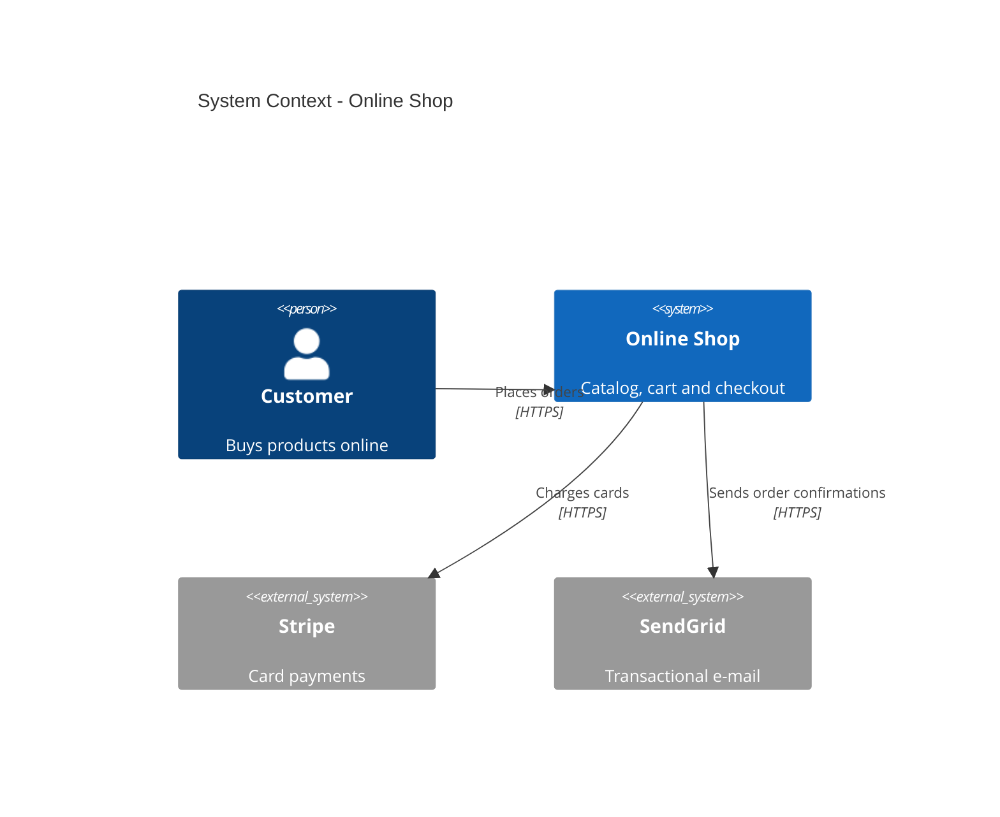

# Online Shop - System Context

```mermaid
C4Context
  title System Context - Online Shop
  Person(customer, "Customer", "Buys products online")
  System(shop, "Online Shop", "Catalog, cart and checkout")
  System_Ext(stripe, "Stripe", "Card payments")
  System_Ext(sendgrid, "SendGrid", "Transactional e-mail")
  Rel(customer, shop, "Places orders", "HTTPS")
  Rel(shop, stripe, "Charges cards", "HTTPS")
  Rel(shop, sendgrid, "Sends order confirmations", "HTTPS")
```

The wiki renderer shows: `No diagram type detected matching given configuration for text: C4Context`
